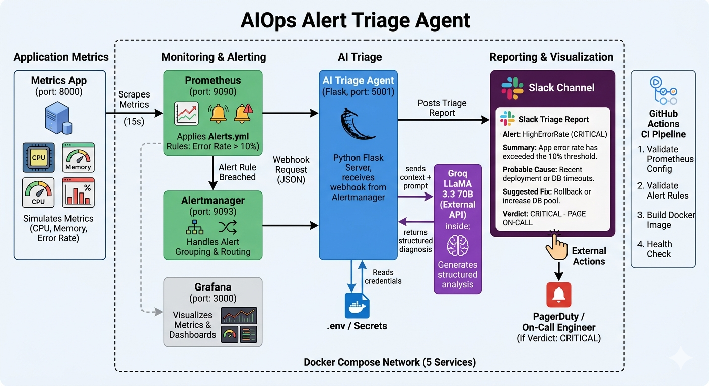
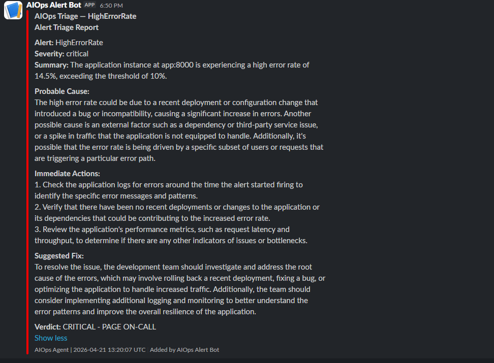
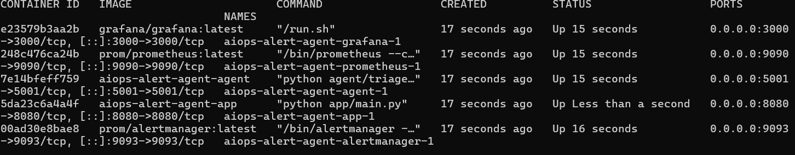
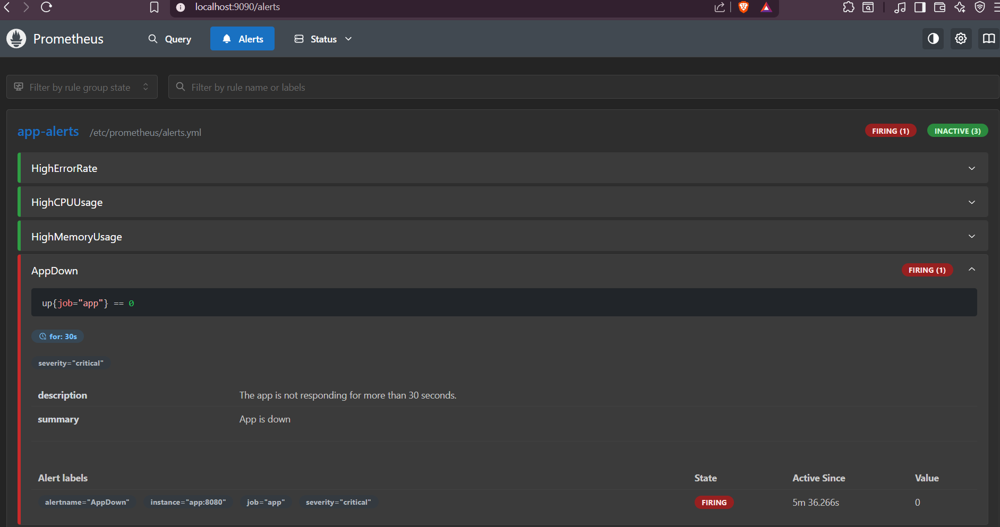
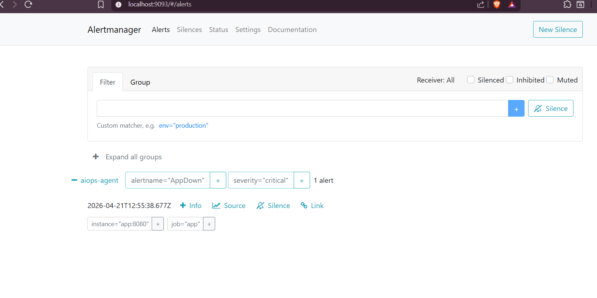
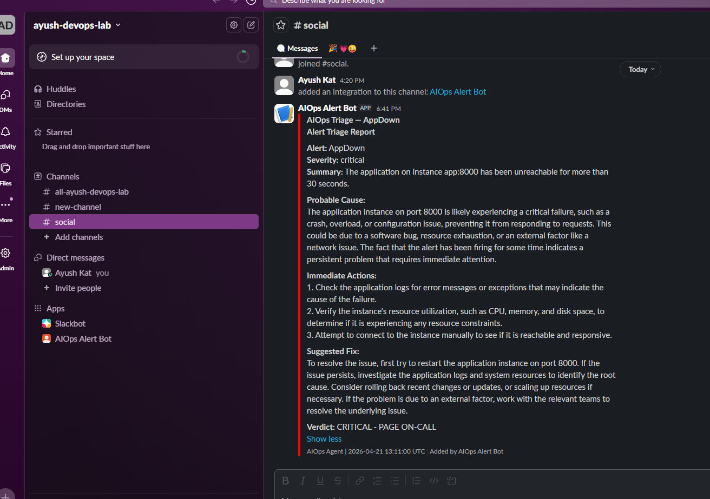
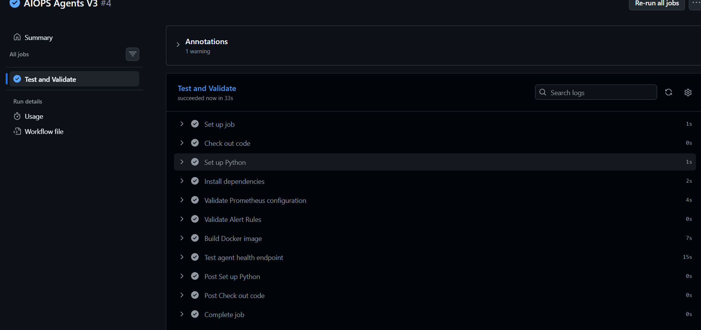

<div align="center">

# AIOps Alert Triage Agent

**An AI-powered alert triage system that automatically diagnoses Prometheus alerts and posts structured reports to Slack.**
No more waking up the on-call engineer for an alert that has an obvious fix. The AI reads it first.



</div>

---

## What is this?

I built this to understand how AIOps works in practice — specifically how teams can reduce alert fatigue by automating the first layer of triage.

The idea: when Prometheus fires an alert, instead of paging a human immediately, an AI agent receives the alert, analyzes it, figures out the probable root cause, suggests immediate actions and a fix, then posts a structured triage report to Slack. The whole thing happens in under 10 seconds.

---

## How it works

```
App exposes metrics on port 8000
          ↓
Prometheus scrapes every 15 seconds
          ↓
Alert rule threshold breached (e.g. error rate > 10%)
          ↓
Alertmanager fires webhook to AI agent
          ↓
Agent sends alert context to Groq LLaMA 3.3 70B
          ↓
LLM returns structured diagnosis
          ↓
Triage report posted to Slack
```

---

## The Slack report looks like this
---



---

## Stack

<table>
  <tr>
    <th>Tool</th>
    <th>Purpose</th>
  </tr>
  <tr>
    <td>Python + Flask</td>
    <td>Webhook server that receives alerts from Alertmanager</td>
  </tr>
  <tr>
    <td>Groq API (LLaMA 3.3 70B)</td>
    <td>LLM that analyzes alerts and generates triage reports</td>
  </tr>
  <tr>
    <td>Prometheus</td>
    <td>Scrapes app metrics every 15 seconds</td>
  </tr>
  <tr>
    <td>Alertmanager</td>
    <td>Receives fired alerts and routes them to the AI agent</td>
  </tr>
  <tr>
    <td>Grafana</td>
    <td>Visualizes metrics with dashboards</td>
  </tr>
  <tr>
    <td>Slack Webhooks</td>
    <td>Delivers triage reports to the team channel</td>
  </tr>
  <tr>
    <td>Docker Compose</td>
    <td>Runs all 5 services together on one network</td>
  </tr>
  <tr>
    <td>GitHub Actions</td>
    <td>Validates Prometheus config and alert rules on every push</td>
  </tr>
</table>

---

## Project Structure

```
aiops-alert-agent/
├── app/
│   └── main.py                     # Metrics app — simulates CPU, memory, error rate
├── agent/
│   └── triage_agent.py             # AI triage agent — Flask webhook + Groq + Slack
├── prometheus/
│   ├── prometheus.yml              # Scrape config and Alertmanager target
│   └── alerts.yml                  # Alert rules (error rate, CPU, memory, app down)
├── alertmanager/
│   └── alertmanager.yml            # Routes alerts to the AI agent webhook
├── docker-compose.yml              # Runs all 5 services together
├── Dockerfile                      # Shared image for app and agent services
├── requirements.txt                # Python dependencies
└── .github/
    └── workflows/
        └── ci.yml                  # Validates configs + builds image on every push
```

---

## Alert Rules

<table>
  <tr>
    <th>Alert</th>
    <th>Condition</th>
    <th>Severity</th>
  </tr>
  <tr>
    <td>HighErrorRate</td>
    <td>Error rate > 10% for 1 minute</td>
    <td>Critical</td>
  </tr>
  <tr>
    <td>HighCPUUsage</td>
    <td>CPU > 80% for 1 minute</td>
    <td>Warning</td>
  </tr>
  <tr>
    <td>HighMemoryUsage</td>
    <td>Memory > 800MB for 1 minute</td>
    <td>Warning</td>
  </tr>
  <tr>
    <td>AppDown</td>
    <td>App unreachable for 30 seconds</td>
    <td>Critical</td>
  </tr>
</table>

---

## Running Locally

**Prerequisites:** Docker Desktop, a Groq API key (free at console.groq.com), a Slack webhook URL

**1. Clone the repo**

```bash
git clone https://github.com/ayush272001/aiops-alert-agent.git
cd aiops-alert-agent
```

**2. Create your `.env` file**

```bash
GROQ_API_KEY=your_groq_api_key_here
SLACK_WEBHOOK_URL=https://hooks.slack.com/services/YOUR/WEBHOOK/URL
```

**3. Start everything**

```bash
docker-compose up --build
```

**4. Verify all services are running**

| Service | URL |
|---------|-----|
| Metrics app | http://localhost:8000 |
| AI agent | http://localhost:5001/health |
| Prometheus | http://localhost:9090 |
| Alertmanager | http://localhost:9093 |
| Grafana | http://localhost:3000 |

---
### Docker Containers Up and Running
---


---
### Prometheus Alerts
---


---
### AlertManager
---


---

## Trigger a Test Alert

Fire a manual alert to test the full flow end to end:

**On Linux/Mac:**

```bash
curl -X POST http://localhost:5001/webhook \
  -H "Content-Type: application/json" \
  -d '{
    "alerts": [{
      "status": "firing",
      "labels": {
        "alertname": "HighErrorRate",
        "severity": "critical",
        "instance": "app:8000"
      },
      "annotations": {
        "summary": "High error rate detected",
        "description": "App error rate is 14.5% which is above the 10% threshold."
      },
      "startsAt": "2024-01-15T10:30:00Z"
    }]
  }'
```

Check your Slack channel within 10 seconds — the triage report will appear automatically.



---

## CI Pipeline

GitHub Actions runs on every push and PR. It validates your infrastructure config before anything runs locally.

<table>
  <tr>
    <th>Job</th>
    <th>What it checks</th>
  </tr>
  <tr>
    <td>Validate Prometheus config</td>
    <td>Runs promtool check config against prometheus.yml</td>
  </tr>
  <tr>
    <td>Validate alert rules</td>
    <td>Runs promtool check rules against alerts.yml</td>
  </tr>
  <tr>
    <td>Docker build</td>
    <td>Confirms the image builds without errors</td>
  </tr>
  <tr>
    <td>Health check</td>
    <td>Starts the agent container and hits /health to confirm it starts</td>
  </tr>
</table>

---


## Security

All sensitive credentials are stored as GitHub Actions secrets and local `.env` file — never hardcoded in the codebase.

<table>
  <tr>
    <th>Secret</th>
    <th>Purpose</th>
  </tr>
  <tr>
    <td><code>GROQ_API_KEY</code></td>
    <td>Authenticates with Groq's LLM API for alert analysis</td>
  </tr>
  <tr>
    <td><code>SLACK_WEBHOOK_URL</code></td>
    <td>Posts triage reports to your Slack channel</td>
  </tr>
</table>

---

## What I learned building this

The most interesting part was understanding how Alertmanager routes alerts. It groups alerts by label, waits for a quiet period before firing, and handles resolved states — so your Slack doesn't get flooded with duplicates when an alert keeps flapping.

The AI prompt engineering mattered more than I expected. The first version returned vague responses. Adding explicit structure to the prompt — forcing the LLM to always output probable cause, immediate actions, and a clear verdict — made the reports actually useful for triage rather than just interesting to read.
